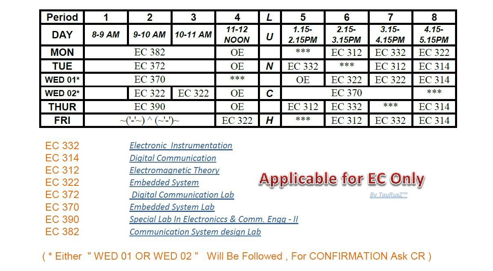

6th Semester, Electronics and Communication Engineering (ECE), NIT Rourkela
(Spring 2013).

 

Courses:
- [Operating System](https://github.com/nitrece/operating-systems)
- [Embedded Systems](https://github.com/nitrece/embedded-systems)
- [Digital Communication Laboratory](https://github.com/nitrece/digital-communication-laboratory)
- [Communication System Design Laboratory](https://github.com/nitrece/communication-system-design-laboratory)

 
 

 

